# Домашнее задание к занятию "`Ansible - часть 2`" - `Алексей Сафронов`

### Задание 1

1. 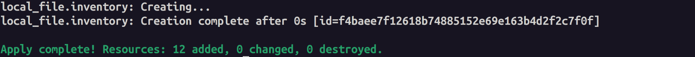
2. 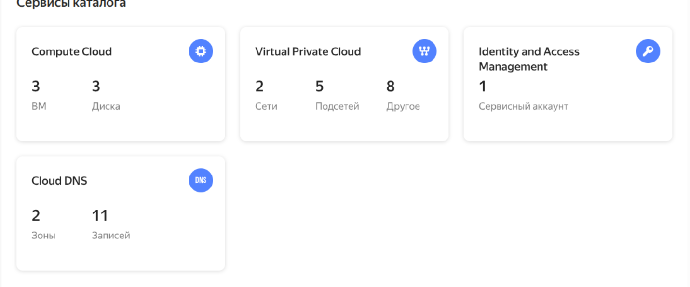
3. 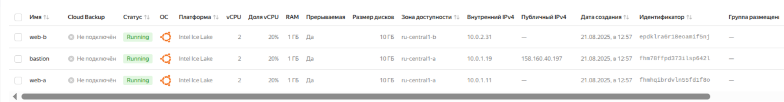

---

### Задание 2

1. 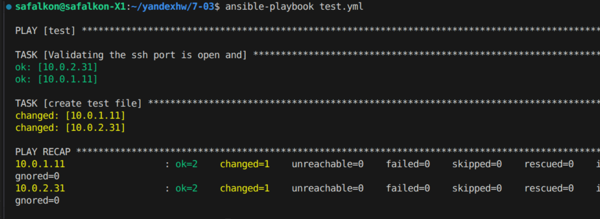
2. 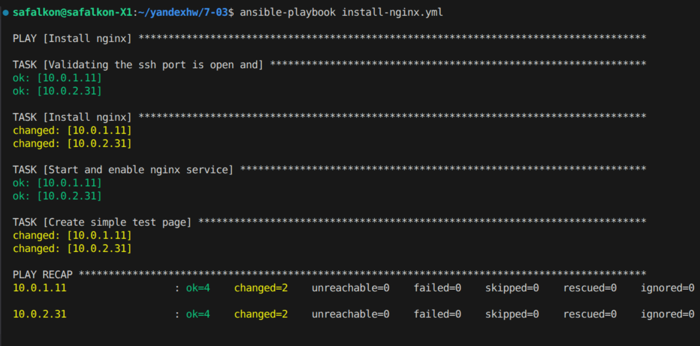
3. 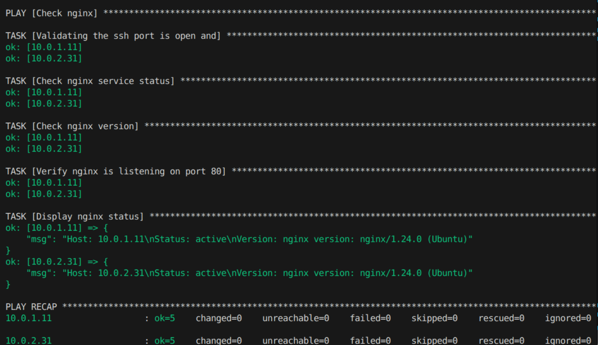

[nginx](install-nginx.yml)
[check-nginx](check-nginx.yml)

---

### Задание 3

1. 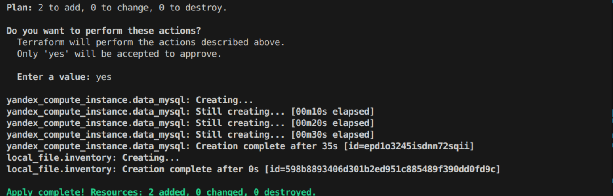
   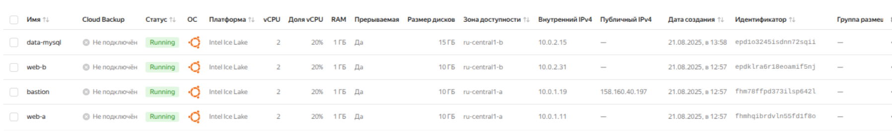
2. 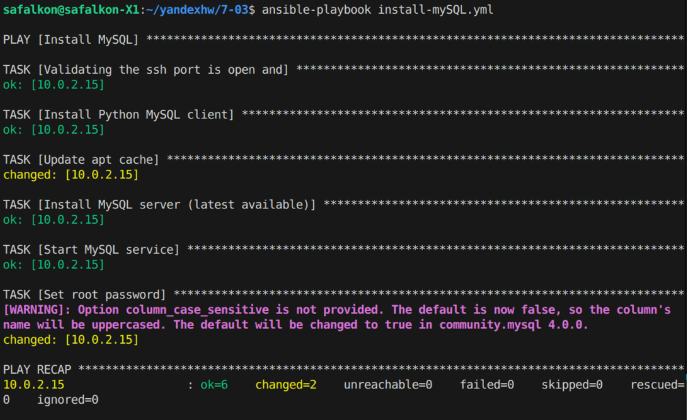
3. 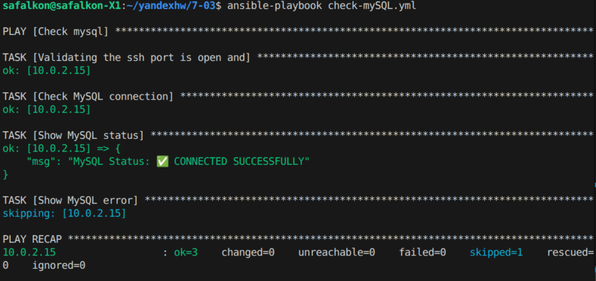

[install-mySQL](install-mySQL.yml)
[check-mySQL](check-mySQL.yml)

---

### Задание 4

1. 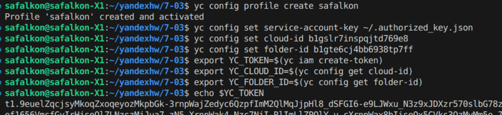
2. 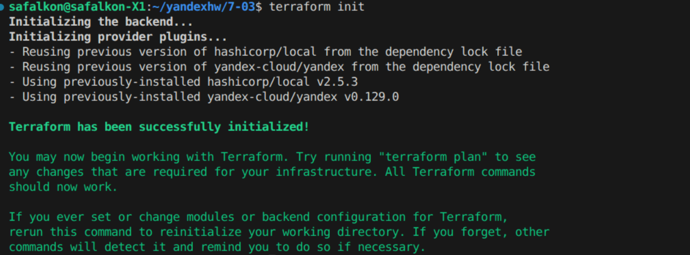
3. 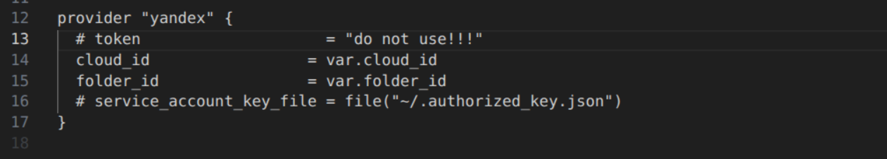